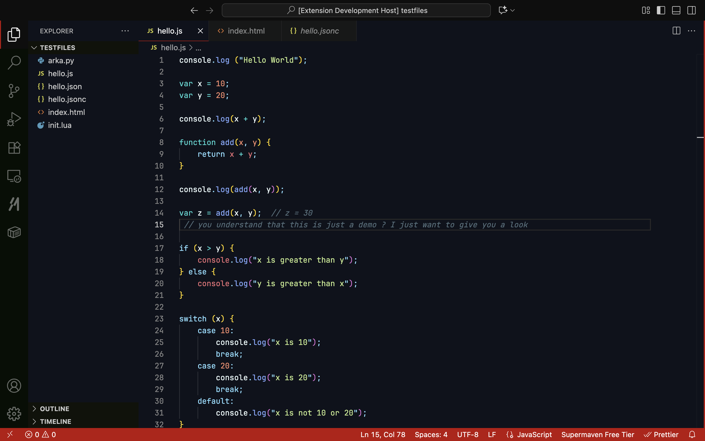
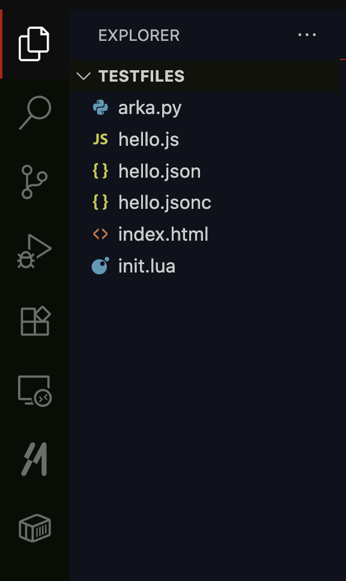

# ArkaTheme 3 — VS Code Theme Extension

ArkaTheme 3 is a sleek, modern, and performance-focused theme for [Visual Studio Code](https://code.visualstudio.com/).
It’s designed for developers who want **clarity, contrast, and elegance** while coding.

## ✨ Features

* ⚡ **High readability** — carefully chosen color contrasts for long coding sessions.
* 🎨 **Modern palette** — minimal yet vibrant colors to highlight the most important syntax.
* 🌙 **Dark, Red-Black aesthetic** — crafted for focus and reduced eye strain.
* 🧩 Works great with icons, custom fonts, and high-DPI monitors.


### Editor View



### Sidebar & Explorer



---

## 🚀 Installation

1. Open **VS Code**.
2. Go to the **Extensions Marketplace** (`Ctrl+Shift+X` or `⌘⇧X`).
3. Search for **ArkaTheme 3**.
4. Click **Install**.
5. Open the Command Palette (`Ctrl+Shift+P` / `⌘⇧P`) → type **Color Theme** → choose **ArkaTheme 3**.


## ⚙️ Recommended Setup

To get the best look:

```jsonc
// settings.json
{
  "editor.fontFamily": "Fira Code, JetBrains Mono, Consolas, 'Courier New', monospace",
  "editor.fontLigatures": true,
  "workbench.iconTheme": "material-icon-theme",
  "workbench.colorTheme": "ArkaTheme 3",
  "window.titleBarStyle": "custom",
  "window.transparency": true // for supported systems/extensions
}
```

## 🧑‍💻 Contributing

Have suggestions? Open an [issue](https://github.com/yourusername/ArkaTheme3/issues) or submit a PR.
Every improvement makes the theme better for all developers.

## 📜 License

This project is licensed under the [MIT License](LICENSE).
Feel free to fork, modify, and share!

---

## 💡 Author

**Arka Banerjee**
Links: [GitHub](https://github.com/thearkabanerjee)• [Twitter](https://twitter.com/thearkabanerjee)
Passionate about building clean, developer-first tools.

---

ArkaTheme 3 is more than just a theme — it’s a **VIBE**.
Hope you have a great experience coding with it!

